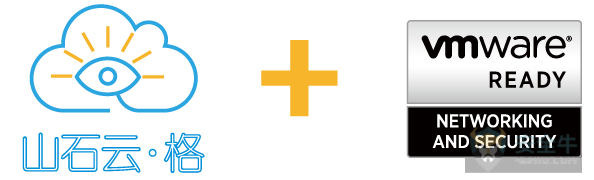

# VMware云安全联盟大会-实现零信任安全模型需要云原生与微隔离紧密结合

## 链接

<https://www.aqniu.com/industry/34480.html>

## 正文

作者：山石网科星期二, 五月 29, 2018

5月24日，全球云基础架构和移动商务解决方案的领导厂商、全球企业软件创新领导者VMware公司在北京长城饭店举办了“云领先锋，共筑生态”云安全联盟大会，作为国内首批获得VMware Ready认证的安全厂商，山石网科受邀参会并发表重要演说，与VMware及国内外领先的安全厂商一同探讨、交流，如何用新视角、新思路和新技术为现代化的数据中心提供多层次、多维度的安全保障。

在数字化业务已成主流的今天，信息基础架构正发生着重大变化。在新的安全法规和等级保护要求下，传统的安全模式已无法为快速变化的应用和日益增长的用户提供足够的保护。那么，在云环境下的安全具备哪些特点？它们与传统安全领域有怎样的关联和区别？山石网科高级副总裁与首席技术专家杨庆华先生参加圆桌论坛，并对此发表了自己的见解。杨总表示，在云上做安全，需要在良好的生态环境下用新思路解决新问题，去适应云的“动态化”。

国际权威研究咨询公司Gartner统计，2017年全球信息安全产品及服务开支比2016年增长了7%，这一数字预计在2018年将达到930亿美元。但就是在企业对网络安全投入越来越多的情况下，数据泄露事件依然层出不穷，对企业造成了严重的损失。

当下，云计算因其开发快、部署快、调整快、扩展灵活、运维简化、成本降低等特点更适用于数据共享、联合处理的需求，而备受用户关注。但同时，也正是因为云计算的灵活性和时效性给安全带来了很大隐患。对此，山石网科云计算安全产品线总监荣钰先生在下午的分论坛上分享了题为“阻断云中数据泄露之路——云中实践零信任安全模型”的演讲。

```
面对灵活多变的云端威胁，零信任安全模型被认为是当下最佳的解决方案。在零信任安全模型中，我们要围绕不同的数据资产划分安全域，由内到外设计网络，构筑安全防护。确保对所有资源的访问行为都是安全的，不论是来自内部还是外部。采用最低特权，严格访问控制。核心部署高度集成隔离网关，集中管理。检查和记录所有流量，实现完整网络的流量和威胁可视化。
```

要实现**零信任安全模型**，需要云原生与微隔离紧密结合。**山石网科的创新分布式网络侧微隔离产品山石云·格，通过虚机微隔离及可视化技术，为用户提供全方位的云安全服务，包括流量及应用可视化，虚机之间威胁检测与隔离，网络攻击审计与溯源。云原生环境下，虚机角色单一，网络通信模型固定，山石云·格独有的透视镜功能可以为每个虚机直观的画出网络画像，方便管理员制定最小安全授权策略，发现高级可持续攻击。山石云·格的智能策略助手功能极大的降低了安全管理员的工作强度，能够自学习虚机或安全域的通信行为，为每一个微安全域设定最贴切的最低授权安全策略，真正让零信任安全模型与云原生有效结合。**山石云·格充分利用编排技术和云平台接口，智能感知云内变化，让安全随需而动。



近日，山石云·格在经过VMware严格的测试验证后，拿到了VMware Ready认证，这意味着国内领先的网络安全厂商山石网科与全球最大的云计算平台厂商VMware将继续深化合作。山石云·格与VMware NSX结合，会给用户带来全面防护、高性能、高可用的云计算安全方案，真正在云计算环境下实现“零信任安全模型”！

## END
