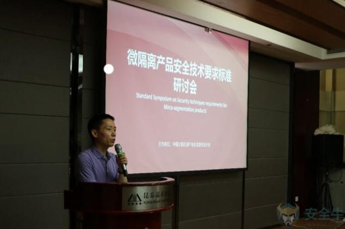

# 微隔离技术规范发布-聚焦流量可视化与策略管理

## 链接

<https://www.aqniu.com/industry/34470.html>

## 正文

2018年5月26日，中国计算机用户协会信息安全分会召开技术研讨会，针对由ISCCC发布的国内第一个微隔离技术规范《微隔离产品安全技术要求》进行讨论，会上来自业界的知名专家对规范进行了热烈探讨。

该规范将微隔离（Micro-segmentation）定义为，***一种能够适应虚拟化部署环境，能够识别和管理云平台内部流量的一种隔离技术。符合微隔离安全技术规范的产品，应在流量识别、业务关系拓扑、网络访问控制、和安全策略管理方面具有规范所要求的能力。并且要求“在不更改虚拟化业务架构的情况下，对虚拟机数量进行扩展时，微隔离产品应支持自动发现扩展的虚拟机，并自动对其进行策略配置。”***

国内首家通过该规范认证的安全初创公司，蔷薇灵动CEO严雷在会上发布了其独具特色的自适应微隔离技术的产品。

## END
