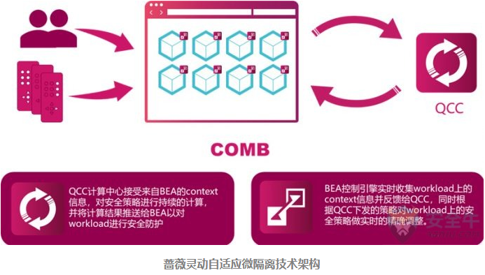

# 微隔离技术规范发布-聚焦流量可视化与策略管理


## 链接

<https://www.aqniu.com/industry/34470.html>

## 正文

作者：王小瑞星期二, 五月 29, 2018

2018年5月26日，中国计算机用户协会信息安全分会召开技术研讨会，针对由ISCCC发布的国内第一个微隔离技术规范《微隔离产品安全技术要求》进行讨论，会上来自业界的知名专家对规范进行了热烈探讨。


该规范将微隔离（Micro-segmentation）定义为，***一种能够适应虚拟化部署环境，能够识别和管理云平台内部流量的一种隔离技术。符合微隔离安全技术规范的产品，应在流量识别、业务关系拓扑、网络访问控制、和安全策略管理方面具有规范所要求的能力。并且要求“在不更改虚拟化业务架构的情况下，对虚拟机数量进行扩展时，微隔离产品应支持自动发现扩展的虚拟机，并自动对其进行策略配置。”***

国内首家通过该规范认证的安全初创公司，蔷薇灵动CEO严雷在会上发布了其独具特色的自适应微隔离技术的产品。

蔷薇灵动的自适应技术主要解决的是，**在数据中心内部系统环境持续发生变化时，如何自动调整安全策略的问题。**在过去，应用的迁移及拓展过程中，企业面临着很多的安全问题，而通过蔷薇灵动的自适应安全管理平台，利用身份特征，自动识别新业务单元角色，自动配置安全策略，则可以有效的解决这些问题。



```
通过对环境参数的持续监控，重新计算出新的安全配置，并自动的将配置下发到每一个工作节点上，从而使安全策略可以和业务一起动态的变化调整，近而打造出一个监听->理解->行动->持续监听的自适应微隔离安全闭环。
```

来自信息产业信息安全测评中心的专家在研讨中表示，**《微隔离产品安全技术要求》**，结合了国际先进技术理念和国内实际环境。接下来，在进一步修订的基础上，进一步有可能提交申请行标和国标。

而来自公安部等级保护的专家也谈到，等级保护发展到了2.0这个阶段是一个巨大的跨越，在产品技术上和技术规范上都需要大家努力创新，才能把等保的要求落到实处。《微隔离产品安全技术要求》的发布以及蔷薇灵动相关产品的投入生产，就非常有利于我们的行业用户在云安全等级保护工作中获得具体的指导和技术支撑。

讨论会上，蔷薇灵动还与北京亦庄国际产业互联网研究院签署了共同成立云安全实验室的合作协议，在用户需求和技术提供之间建立一个良好的通道。

**最早由VMware提出，后由Gartner定义的微隔离技术在国内已经有一些较为成熟的产品形态，大致可分为云服务商、防火墙厂商和主机安全厂商三类。前两者在适配性和性能开销方面存在短板，因此在主机上安装agent这种技术路线的初创企业，存在着不错的市场需求。**

据悉，蔷薇灵动的微隔离产品，已经有了包括首钢、海淀区政府等几家用户，均反应良好。其运行时的计算资源开销，只有0.2%，流量开销也是微乎其微。


## END
