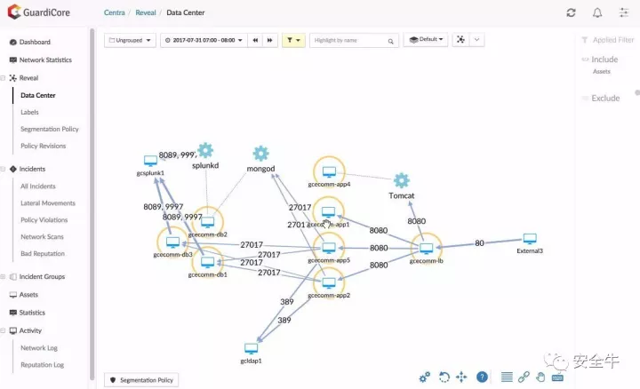
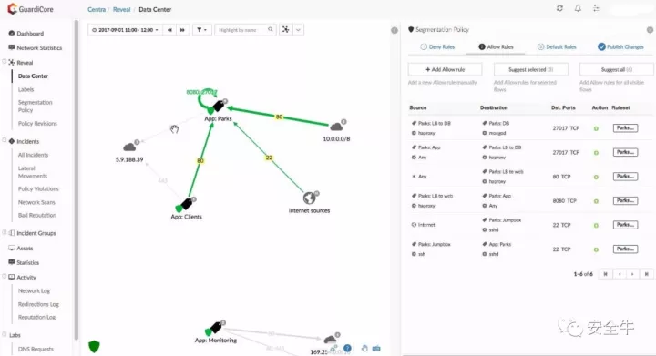

# 看看GuardiCore Centra是怎么做好微隔离的

## 链接

<https://mp.weixin.qq.com/s?__biz=MjM5Njc3NjM4MA==&mid=2651074198&idx=2&sn=a04d735b31ab559302e9a1bfbb804e30&chksm=bd149e458a631753d9c4c81d774cf7fc80772b8f97d48ae7f5f973f36350fc60779e84630f7e&scene=21#wechat_redirect>

## 正文

安全牛  2017-11-02

微隔离，是新兴的安全方法之一，企业可用来保护关键资产、用户和数据不受外部黑客及恶意内部人的侵害。授权网络中每个过程、App、用户和服务，以及它们能做的事务和互动的方式，同时还要拒绝其他所有事件，几乎无所不能。

因此，在描述优秀的微隔离技术产品时，厂商很难控制住自己不用“刀枪不入”这种形容词，即便我们都清楚：坏人最终总能找到绕过安全方法的途径。

微隔离最大的问题，**在于其要求对受保护网络的大量洞见和可见度，第4层（传输层）和第7层（应用层）都需要，而这几乎是每家企业当前所欠缺的**。且其本质就是极端限制性的，**对用户可做的事和做事的方式限制极严**。除非有相对平滑的过程可按需授权网络上的新过程或修改旧过程，否则微隔离可能会意外限制了合法用户的工作。

## GuardiCore Centra提供什么

GuardiCore Centra解决方案考虑到了这些因素，从初始安装到正在进行的项目管理中，都去除了通常与微隔离相关的大多数复杂性。如果有需要的话，GuardiCore Centra 解决方案甚至可阶段性安装，作为第4层上健壮但等比缩小的无代理防护程序；或者，作为第7层防护套装中，在所有资产上都部署有代理的全面微隔离解决方案安装。

Centra还足够灵活，可部署到几乎任何设置中，包括企业内部、云环境，或者GuardiCore云上运行的软件即服务(SaaS)。SaaS模式中，没有任何专有信息会离开宿主网络，只有元数据会。它甚至能在重软件定义联网的云端运营，随时适应并跟踪不断变化的网络拓扑。Centra的收费机制也设计得几乎能适应任何环境，基本遵循按规模年度订阅模式，每台实体服务器2500美元起，每台虚拟机250美元起。

订阅用户可获得整个Centra套装的访问权，包括在第4层和第7层上操作的能力，一个发现及可见性组件，甚至用于捕获流氓用户和尝试违反隔离规则App的动态陷阱工具。GuardICore Centra 已在云环境虚拟机上经过测试。

## 对网络资产和活动的可见性

因为没有可见性就没有微隔离，GuardiCore Centra专注提供对网络资产和活动的深入视图。有两种方式：首先，可部署虚拟收集器设备，收集流量和应用数据。这就能获得对活动的大量洞见，包括各种应用正在使用的端口，而这些数据也可成为定义新策略的良好起点，作为分隔工作的一部分。

良好分隔安全的关键在于可见性，GuardiCore Centra 程序套装，可提供查找和定义整个网络上每个资产、服务、App和在用端口的最佳方法。

Centra还提供可视化图表，让所有这些交互更易于理解和跟踪。Centra的这种使用方式可以产出良好的可见性，但并未包含真正的微隔离所需的全部极致细节。即便这种方式仅能在第4层上提供防护，这些数据也能被不愿或不习惯部署代理的公司企业所用。

来到第7层防护，Centra的真正力量就变得明显了，它可以通过在每台虚拟机、容器和裸机管理程序上部署代理，实现随时激活功能。收集器爬取第4层流量所形成的网络地图可能继续保持几乎原样，只是增加了更多细节——一旦代理部署到位并能看到基本上所有东西。该功能也经过了本次评估的测试。

## 设置微隔离及规则

一旦获得可见性，管理员就可以开始设置分隔和微隔离了。第一步是弄出拒绝规则，而其中他们想首先着手的第一件事，恐怕是合规。每个行业基本都有某种形式的规矩或最佳实践，业内人要么被建议，要么被强制这么做。这些规则往往没那么具体，更多像是常识一类的东西，但仍然很重要。

一旦你开始创建微隔离策略，GuardiCore可告诉你每个App的运行情况，或挂起/停止情况——基于这些分隔策略。绿线表示现行微隔离策略下被允许的动作。

测试，拒绝规则创建这第一步里，实现的是支付卡行业数据安全标准(PCI DSS)。因为其中不涉及任何开放协议，一旦规则被激活，就会立即锁定一些明显的违规行为。主控制面板上可以很容易看出哪些用户和App受到了影响。如果需要的话，就可以建立可选的允许规则，让有需求的员工以可被授权和监控的安全方式完成自己的工作。

GuardiCore Centra套装主仪表板上，一眼就能看到网络中所有正在发生的合法事件，以及有哪些用户或App尝试违反现有规则。

拒绝规则就位后，实现允许规则就成了接下来的步骤。Centra在允许规则设立上依然表现良好，它可在协议级良好呈现网络中正在发生的每一个过程。浏览App在网络中的每一步及其与外部世界通联的时间，授权并锁定这些动作以便今后不会有变化，对Centra来说也是非常容易的。在界面中，Centra以绿线标出被微隔离特意允许的那些进程。

为测试分隔效果，某恶意程序被安装到了合法服务器上。该程序尝试使用其经授权“孪生兄弟”的同一条信道和端口，来初始化一个授权进程。即便在第4层监测，该动作可能也会被允许，但Centra提供的第7层可见性，让该非常隐秘的攻击无所遁形——即使它镜像的是已授权进程的通路。为什么呢？因为新初始化的进程散列值与经授权的那个不同。Centra检测到这种“分身”就可以采取恰当的动作，完全封锁之，或者将之发给陷阱程序。规则违反报告也可以用开源协议绑定，并发送给任意联网SIEM。

陷阱组件的引入，让GuardiCore Centra提供的微隔离更加强大。不是简单地封禁非法进程，Centra可将之重定向到动态陷阱组件，记录下恶意程序或用户的每一步动作，包括一系列截屏，让审计工作变得非常简单。陷阱网络是状态敏感的，如果合法服务器下线进行维护，试图访问之的用户就不会被意外重定向到陷阱组件。

GuardiCore套装的动态陷阱。违反策略的任何用户都可被发往某个陷阱组件，所有动作和互动都会被记录下来供分析审计。

即便有了GuardiCore Centra解决方案提供的超有用可见性和图形化界面，在非常复杂的网络上设置深度微隔离，依然有可能是个很长的过程。有没有这套解决方案的区别在于，该程序本身并不会倍增这个时间框架。这东西极其用户友好，鉴于其强大的功能，真的是个惊喜。用户可能不到一天的培训就能掌握。

GuardiCore Centra解决方案提供了一种非常高效的方式来实现强大的微隔离安全。其易用性、恰当的价格，还有物理或虚拟环境皆可用的特性，不过是对该令人印象深刻的安全工具集的锦上添花而已。
