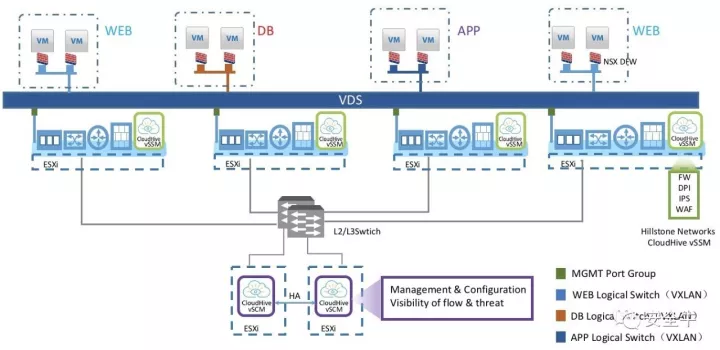

# 真正的云安全微隔离技术来了-云·格全面支持VMwareNSX平台

## 链接

<https://www.aqniu.com/industry/34470.html>

## 正文

原创： 王小瑞  安全牛  2017-10-28

近日，山石网科与VMware联合发布全面支持VMware NSX平台的山石云·格产品，成为国内首家支持VMware NXS平台的网络安全厂商，填补了国内云安全生态的空白。

山石网科产品市场副总裁张凌龄表示：

```
VMware是最知名的云服务提供商，拥有最广泛的用户基础，这次合作是云服务领域与云安全领域的强强联合，相信我们共同努力打造的健康云生态能够为更多用户带来虚拟化建设的信心与力量。
```

## 云·格与NSX结合的技术原理

虚机的虚拟网卡(vNIC)接入在NSX的分布式防火墙(DFW)上，DFW再接入虚拟交换机，相当于为每个虚机的网卡都配备了一个防火墙。根据管理员的设置，DFW会将选择了深度防护的数据包，重定向给部署在每台ESXi的云·格的vSSM卡，最后云·格再把通过安全审核的数据包送到虚拟交换机上。



举个例子：

NSX DFW只允许一组Web服务虚机与内部、外部虚机利用TCP80端口进行通信，其他端口的访问、与数据库虚机的访问等等均被NSX的2-4层访问控制禁止掉。NSX会把80端口的流量重定向给云·格，以实现应用识别、访问控制、恶意代码查杀等更细粒度的安全防护。同时云·格特有的可视化能力，也可以描绘出虚机间交互的关系，哪些虚机间发生过通信，实际是什么应用，应用的流向，耗费带宽等等。

据VMware大中华区产品部总经理冼超舜博士介绍，NSX在中国的成长速度非常快，两年来平均每个季度都是成倍的增长率。目前，NSX全球有6000个客户，包括中国的两大运营商。

## 安全牛评

真正的云计算是以是否实现SDN（软件定义网络）为重要标志的，而做为全球云基础架构领导者的VMware，其NSX平台堪称是SDN技术最成熟的落地。

云·格在NSX平台把控基本的访问控制和安全域划分的基础之上（二到四层），实现了基于应用的访问控制与可视（五到七层），将性能、安全以及控制粒度有机结合，从而完成了云安全架构的本土化落地，同时也是体现云计算中心零信任安全模型的技术实践之一。
